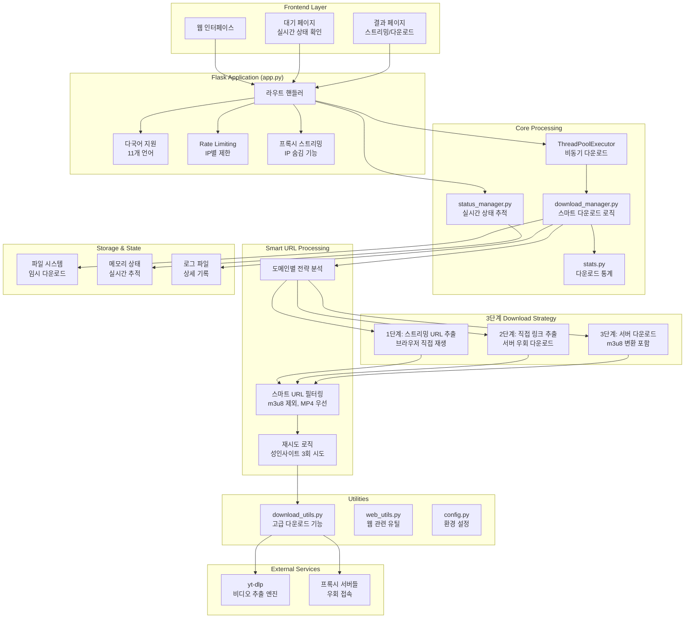
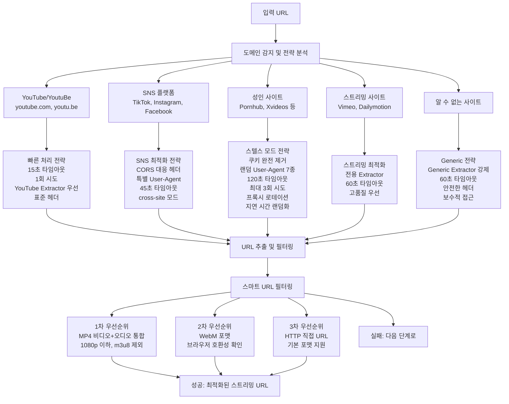
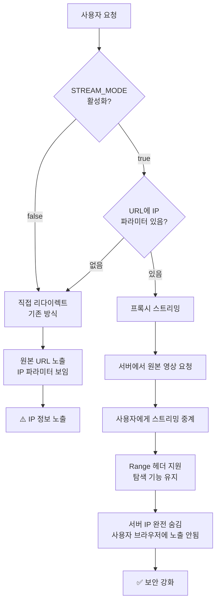
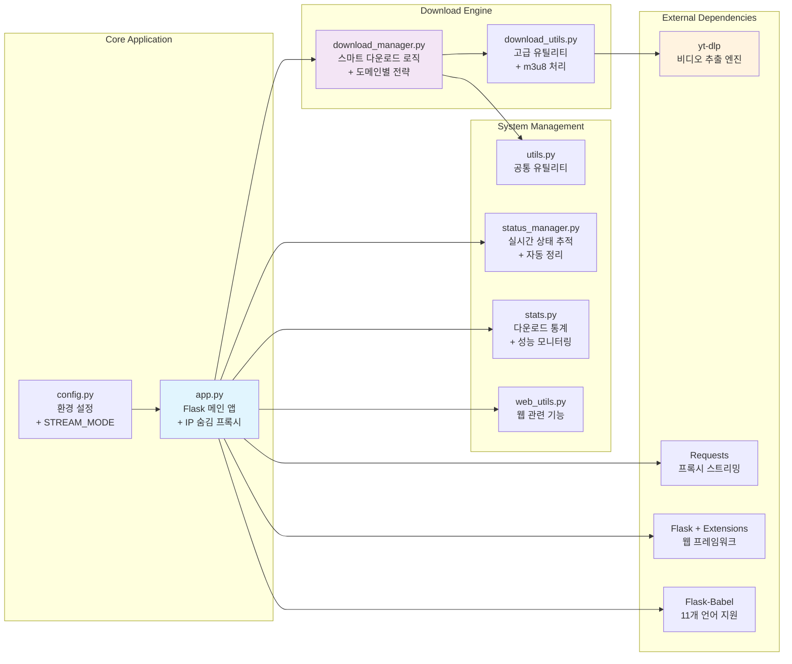

# dl-test

# Docker
## Docker build
```bash
docker build -t raphael1021/dl-test .
```

## Run
5000 port는 맥에서 다른걸로 점유하고 있는듯  
8080 port로 변경

```bash
docker-compose build

docker-compose up -d

docker-compose logs -f
```

# 프로젝트 아키텍처

## 전체 시스템 구조


## 스마트 다운로드 프로세스 (향상된 3단계 폴백 시스템)

```mermaid
sequenceDiagram
    actor User as 사용자
    participant Web as 웹인터페이스
    participant Thread as ThreadPoolExecutor
    participant Manager as 다운로드매니저
    participant Strategy as 도메인별전략분석
    participant Stream as 스트리밍URL추출
    participant Direct as 직접링크추출
    participant Server as 서버다운로드
    participant Proxy as IP숨김프록시
    participant Status as 상태관리
    participant FS as 파일시스템
    participant YT as yt-dlp

    User->>Web: 비디오 URL 입력
    Web->>Web: UUID 생성 (file_id)
    Web->>Thread: 다운로드 작업 제출
    Web->>User: 대기 페이지로 리다이렉트

    Thread->>Manager: download_video() 호출
    Manager->>Status: 처리 중 상태 업데이트 (10%)
    
    Note over Strategy: 도메인별 전략 분석
    Manager->>Strategy: detect_url_type_and_strategy()
    Strategy->>Strategy: 도메인 분석 및 최적화 전략 결정
    Note over Strategy: YouTube: 15초 타임아웃<br/>성인사이트: 스텔스모드+3회시도<br/>SNS: CORS 대응<br/>일반: Generic Extractor
    Strategy-->>Manager: 최적화된 추출 전략
    
    Note over Stream: 1단계: 스트리밍 URL 추출 시도
    Manager->>Stream: extract_streaming_urls()
    
    alt YouTube/일반 사이트
        Stream->>YT: yt-dlp로 정보 추출 (최적화된 설정)
        YT-->>Stream: 비디오 메타데이터 + 포맷 목록
        Stream->>Stream: 스마트 URL 필터링
        Note over Stream: 1차: MP4 비디오+오디오 통합<br/>2차: WebM 포맷<br/>3차: HTTP 직접 URL<br/>m3u8/HLS 완전 제외
        Stream-->>Manager: 브라우저 재생 가능한 스트리밍 정보
        Manager->>Status: 즉시 완료 처리 (100%)
        Status-->>Web: 스트리밍 URL 제공
    else 성인 사이트/제한 사이트
        loop 최대 3회 시도
            Stream->>Stream: 랜덤 User-Agent + 스텔스 모드
            Stream->>YT: 특별 헤더로 시도 (쿠키 제거)
            alt 성공
                YT-->>Stream: 스트리밍 URL
                Stream->>Stream: URL 유효성 검증 + 필터링
                Stream-->>Manager: 스트리밍 정보 반환
                Manager->>Status: 즉시 완료 처리 (100%)
            else 실패
                Stream->>Stream: 지연 후 다음 시도 (다른 User-Agent)
            end
        end
    end

    Note over Direct: 2단계: 직접 다운로드 링크 시도 (1단계 실패 시)
    alt 스트리밍 추출 실패
        Manager->>Status: 진행률 업데이트 (20%)
        Manager->>Direct: extract_direct_download_link()
        Direct->>YT: 직접 URL 추출 시도 (우회 설정)
        YT-->>Direct: 직접 다운로드 URL
        Direct->>Direct: validate_direct_download_link()
        Direct->>Direct: 파일 크기/타입/접근성 검증
        alt 유효한 직접 링크
            Direct-->>Manager: 직접 링크 정보
            Manager->>Status: 즉시 완료 처리 (100%)
            Status-->>Web: 직접 링크 제공
        else 직접 링크 실패
            Direct-->>Manager: null 반환
        end
    end

    Note over Server: 3단계: 서버 다운로드 (1,2단계 모두 실패 시)
    alt 모든 추출 방식 실패
        Manager->>Status: 다운로드 중 상태 (30%)
        Manager->>Server: try_download_enhanced()
        
        Note over Server: 3-1단계: 최적화된 직접 다운로드
        Server->>YT: 도메인별 최적화 설정으로 다운로드
        alt 직접 다운로드 성공
            YT->>FS: 실제 비디오 파일 저장
            Server->>Status: 진행률 업데이트 (70% to 100%)
            FS-->>Server: 다운로드 완료
            Server-->>Manager: 성공 반환
            Manager->>Status: 파일 정보와 함께 완료 (100%)
        else 직접 다운로드 실패
            Note over Server: 3-2단계: m3u8 폴백 시스템
            Server->>Server: find_m3u8_candidates()
            Server->>Server: HTML 파싱 + JavaScript atob 디코딩
            loop 최대 3개 m3u8 후보
                Server->>Status: 진행률 업데이트 (50% + i*15%)
                Server->>YT: m3u8 to MP4 변환 다운로드
                alt m3u8 변환 성공
                    YT->>FS: 병합된 MP4 파일 저장
                    FS-->>Server: 변환 완료
                    Server-->>Manager: 성공 반환
                    Manager->>Status: 파일 정보와 함께 완료 (100%)
                else m3u8 변환 실패
                    Server->>Server: 다음 후보 시도
                end
            end
        end
    end

    Note over Manager: 모든 방법 실패 시 폴백
    alt 모든 다운로드 방법 실패
        Manager->>Manager: get_video_info() 기본 정보만
        Manager->>Status: 원본 URL만으로 완료 처리
        Status-->>Web: 원본 사이트 리다이렉트 정보
    end

    Note over User,Web: 사용자 상태 확인 루프 (실시간)
    loop 상태 확인 (2초마다)
        User->>Web: AJAX 상태 확인
        Web->>Status: get_status()
        Status-->>Web: 현재 상태 + 진행률
        Web-->>User: 실시간 진행률 표시
    end

    Note over User,Web: 완료 후 결과 표시
    User->>Web: 최종 상태 확인
    Web->>Status: get_status()
    Status-->>Web: 완료 상태 + 결과 정보
    Web->>User: 결과 페이지로 리다이렉트

    Note over Proxy: 결과 페이지에서 처리 (IP 숨김 기능 포함)
    alt 스트리밍 정보 있음
        User->>Web: 비디오 플레이어 요청
        Web->>Web: IP 파라미터 검사
        alt STREAM_MODE=true and IP 파라미터 있음
            Web->>Proxy: 프록시 스트리밍 제공
            Proxy->>Proxy: 원본 서버에서 데이터 중계
            Proxy-->>User: 서버 IP 숨김으로 스트리밍
        else STREAM_MODE=false or IP 파라미터 없음
            Web-->>User: 원본 URL로 직접 리다이렉트
        end
    else 직접 링크 있음
        Web->>Web: IP 파라미터 검사 + 프록시 적용
        Web-->>User: 직접 다운로드 (IP 숨김 적용)
    else 서버 파일 있음
        User->>Web: 파일 다운로드 요청
        Web->>FS: send_file()
        FS-->>User: 서버에서 파일 전송
    else 원본 URL만 있음
        Web-->>User: 원본 사이트로 리다이렉트
    end

    Note over Status: 백그라운드 정리 작업
    par 백그라운드 정리
        loop 1분마다
            Thread->>Status: 오래된 상태 정리 (2분 이상)
            Thread->>FS: 오래된 파일 삭제
            Status->>Status: 메모리 최적화
        end
    end
```


## 도메인별 스마트 처리 전략


## IP 숨김 프록시 시스템 (신규 추가)


## 파일 구조 및 모듈 관계 (업데이트)


## 주요 특징 및 개선사항

### 🚀 성능 최적화
- **도메인별 맞춤 전략**: 각 사이트 특성에 최적화된 추출 방법
- **3단계 폴백 시스템**: 단계별 실패 시 자동 대안 제공
- **스마트 URL 필터링**: m3u8 제외, 브라우저 호환성 우선
- **실시간 상태 추적**: 사용자 경험 향상

### 🔒 보안 및 우회 기능
- **성인사이트 스텔스 모드**: 3회 재시도 + 랜덤 User-Agent
- **IP 숨김 프록시**: 서버 IP 노출 방지 (환경변수 토글)
- **쿠키 제거**: 추적 방지
- **프록시 로테이션**: 차단 우회

### 🌐 다국어 및 사용성
- **11개 언어 지원**: 글로벌 사용자 대응
- **반응형 UI**: 모바일/데스크톱 최적화
- **실시간 진행률**: 2초마다 상태 업데이트
- **자동 정리**: 메모리 및 디스크 최적화

### 📊 모니터링 및 관리
- **상세 로깅**: 단계별 처리 과정 기록
- **통계 수집**: 성공/실패율 추적
- **헬스체크**: 시스템 상태 모니터링
- **Rate Limiting**: 서버 부하 방지
