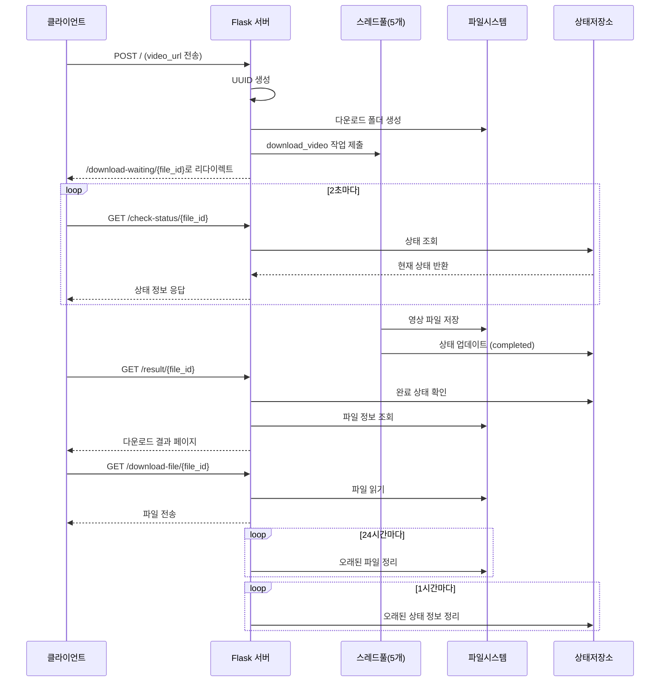

# dl-test

# Docker
## Docker build
```bash
docker build -t video-downloader .
```

## Run
```bash
docker run -d -p 5000:5000 -v $(pwd)/downloads:/app/downloads -v $(pwd)/logs:/app/logs --name video-downloader video-downloader
```

```bash
# Docker Compose로 빌드 및 실행
docker-compose up -d

# 로그 확인
docker-compose logs -f
```

# Diagram

