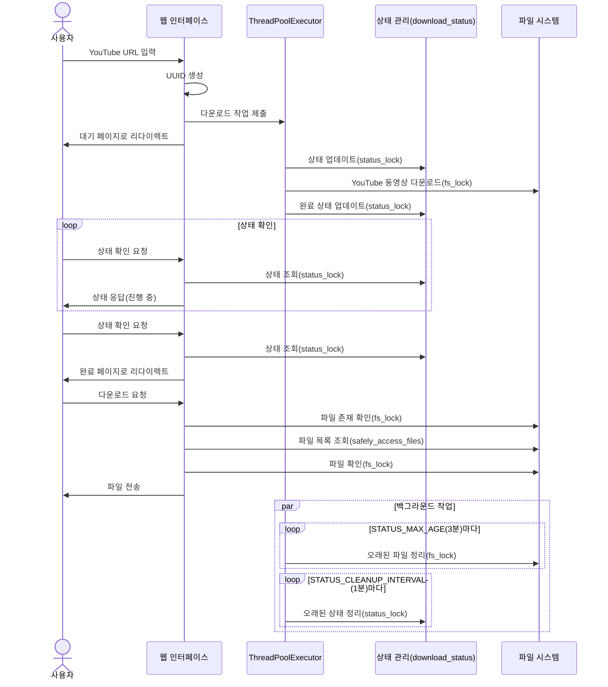

# dl-test

# Docker
## Docker build
```bash
docker build -t raphael1021/dl-test .
```

## Run
5000 port는 맥에서 다른걸로 점유하고 있는듯  
8080 port로 변경

```bash
docker-compose build

docker-compose up -d

docker-compose logs -f
```

# Diagram

