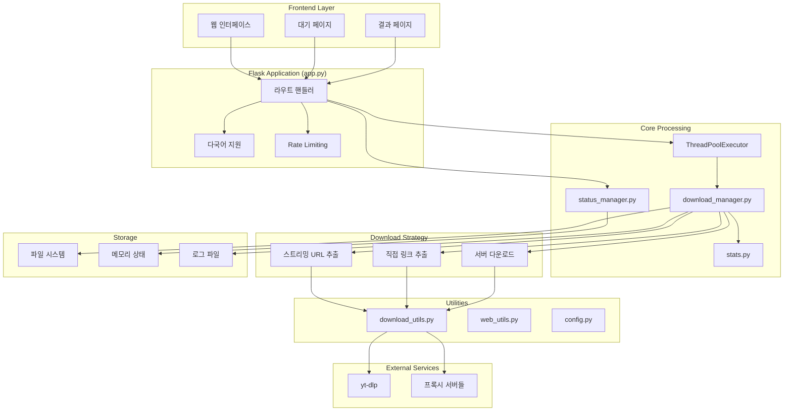
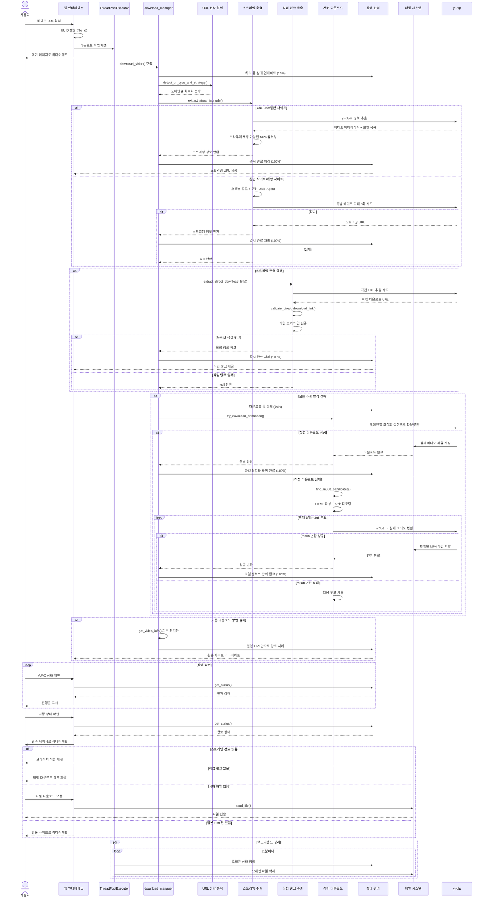
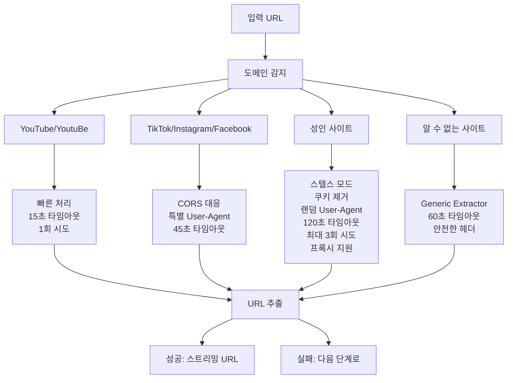
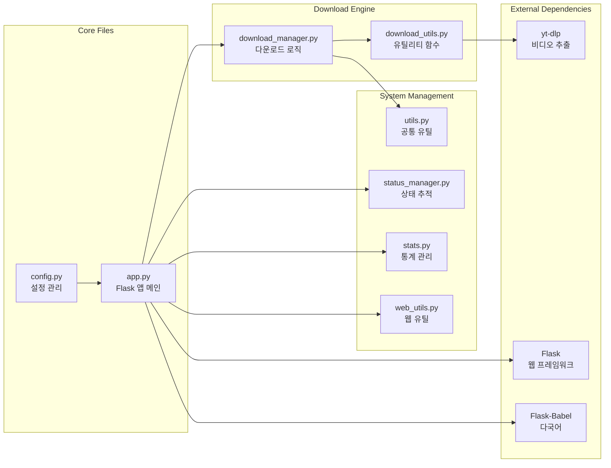

# dl-test

# Docker
## Docker build
```bash
docker build -t raphael1021/dl-test .
```

## Run
5000 port는 맥에서 다른걸로 점유하고 있는듯  
8080 port로 변경

```bash
docker-compose build

docker-compose up -d

docker-compose logs -f
```

# 프로젝트 아키텍처

## 전체 시스템 구조


## 스마트 다운로드 프로세스 (3단계 폴백 시스템)


## 도메인별 처리 전략


## 파일 구조 및 모듈 관계

