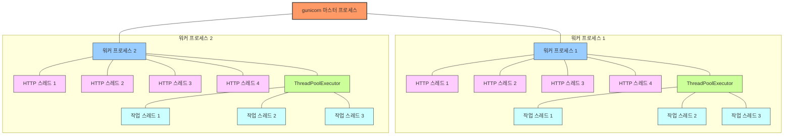

## 병렬 처리 능력
## 1코어 서버와 2코어 서버 구성 권장 이유 설명
#### 1코어 서버 권장 설정 (workers=1, threads=4, MAX_WORKERS=3)
1. **단일 코어 효율성**:
  - 1코어에서는 여러 워커 프로세스가 CPU 시간을 두고 경쟁하므로 프로세스 전환 오버헤드가 발생
  - 단일 워커는 이 오버헤드를 최소화하고 컨텍스트 스위칭 비용 감소

2. **메모리 효율성**:
  - 각 워커는 Python 인터프리터와 애플리케이션 코드 전체를 메모리에 복사
  - 1개 워커만 사용하면 메모리 중복 없이 효율적으로 관리 가능

3. **스레드 활용**:
  - HTTP 요청은 4개 스레드로 처리
  - 다운로드 작업은 ThreadPoolExecutor를 통해 3개 스레드로 처리
  - I/O 바운드 작업이 대부분이므로 GIL 영향 최소화

4. **일관된 상태 관리**:
  - 단일 워커 내에서 download_status 딕셔너리가 공유되어 모든 요청에서 다운로드 상태 일관성 유지
  - 워커가 여러 개면 상태가 분산되어 관리 복잡

#### 2코어 서버 권장 설정 (workers=3, threads=2, MAX_WORKERS=2)
1. **코어 활용 최적화**:
  - 2×코어+1 공식을 따라 3개 워커 권장 (gunicorn 공식 권장사항)
    - 하지만 실제로는 메모리 제약 때문에 workers=3으로 조정합니다. 이는 최소한의 공식 권장사항을 따르면서도 메모리 사용량을 적절히 유지하기 위해 
  - 작업 분산으로 코어 활용도 증가

2. **CPU 작업 분산**:
  - 각 워커는 자체 GIL을 가짐
  - CPU 바운드 작업이 여러 워커에 분산되어 수행 가능

3. **장애 격리**:
  - 한 워커가 실패해도 다른 워커가 서비스 계속 제공
  - 메모리 누수나 충돌이 일부 워커에만 영향

4. **워커별 스레드 수 감소**:
  - 워커당 HTTP 스레드 2개로 충분함 (총 6개)
  - 워커당 다운로드 스레드 2개 (총 6개)로 한 워커에 너무 많은 스레드가 생기지 않도록 제한

### 왜 ThreadPoolExecutor의 MAX_WORKERS 값이 다른가?

1. **1코어 서버 (MAX_WORKERS=3)**:
  - 단일 워커에 약간 더 많은 스레드 할당
  - I/O 작업이 주로 수행되므로 스레드 수 약간 증가해도 성능 향상
  - 동시에 너무 많은 스레드는 메모리 사용량 증가 문제

2. **2코어 서버 (MAX_WORKERS=2)**:
  - 여러 워커가 있으므로 워커당 스레드 수 감소
  - 총 다운로드 스레드는 6개 (3워커 × 2스레드)
  - 워커 간 자원 경쟁 최소화

현재 `Dockerfile`에서 1코어 설정(`workers=1, threads=4`)을 기본으로 사용하고 있는 것도 위의 이유에 따른 것입니다. 작은 서버에서는 자원 효율성을 위해 단일 워커와 다중 스레드 구성이 더 효과적입니다.

## 중요한 고려사항
### 상태 공유 문제:
download_status 딕셔너리는 워커 프로세스 간에 공유되지 않습니다.
워커 1이 시작한 다운로드의 상태는 워커 2에서 확인할 수 없습니다.
사용자가 다른 워커로 라우팅되면 다운로드 상태를 잃어버릴 수 있습니다.

### 파일 시스템 접근:
모든 워커와 스레드가 동일한 파일 시스템에 접근합니다.
fs_lock은 단일 프로세스 내 스레드 간에만 작동하므로, 워커 간 파일 접근 충돌이 발생할 수 있다.
